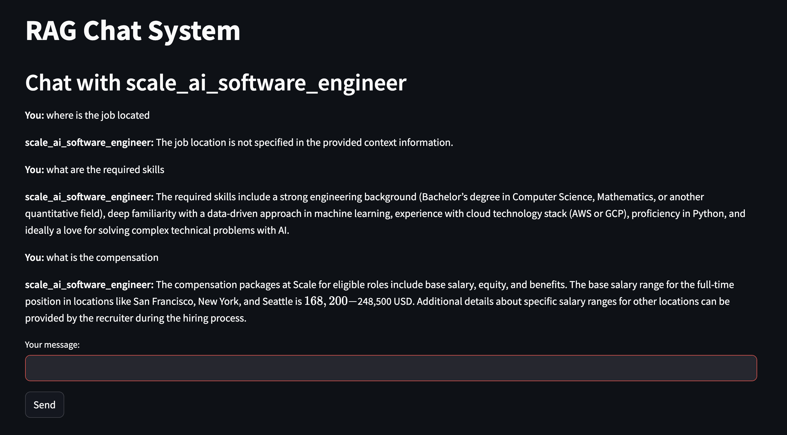

# 🤖 Raggedy, multi-agent Human resource chatbots

## 📚 Overview

**RAG HR agents** is a Retrieval-Augmented Generation (RAG) based AI chat platform that enables users to create intelligent agents trained on custom documentation sources. These agents will be trained on a job desirption that you link in the form field for URL. Currently, HRRag only supports documents from greenhouse.

**Example of the Chatbot working**


## ✨ Features

* 🧠 **Multi-Agent Support** – Create multiple chat agents for different documentation sources
* 💬 **Contextual Chat** – Agents remember past interactions for coherent conversations
* 🔍 **Source-Aware RAG Responses** – Answers are based on relevant documents and cite sources when possible
* 📂 **Agent Management** – Create, select, and delete agents as needed
* 🌐 **Interactive UI** – Streamlit-powered interface for intuitive usage

---

## 🛠️ Technical Components

* **Document Ingestion**: Parses and chunks documents into vector embeddings
* **Vector Storage**: Stores embeddings for efficient similarity-based retrieval
* **Retriever**: Finds the most relevant document chunks for any query
* **LLM Integration**: Uses OpenAI to generate responses based on retrieved context
* **Web Interface**: Streamlit app for managing and interacting with agents

---

## 🚀 Getting Started

### ✅ Prerequisites

* Python `3.12`
* OpenAI API Key (set as an environment variable)

### 📦 Installation

```bash
# Clone the repository
git clone <repository-url>
cd privateRAG

# Install dependencies
pip install -r requirements.txt

# Set your OpenAI API key
export OPENAI_API_KEY=your-api-key
```


### ▶️ Running the App

```bash
streamlit run app.py
```

---

## 🧑‍💻 Usage Guide

1. 🆕 **Create** a new agent by entering a document URL and naming your agent
2. 🔄 **Select** an existing agent from the sidebar
3. 💬 **Chat** with the agent by asking domain-specific questions
4. 🗑️ **Delete** agents when they are no longer needed

---

## 🧪 Testing

The project includes test scripts to verify core functionality:

| Script           | Description                           |
| ---------------- | ------------------------------------- |
| `test_invoke.py` | Test direct chain invocation logic    |
 |

### Run Tests

```bash
python test_invoke.py

```

---

## 📁 Project Structure

```plaintext
rag-chat-system/
├── app.py             # Main Streamlit application
├── chat_agent.py      # Agent creation and management
├── ingest.py          # Document ingestion and embedding
├── retriever.py       # Vector store retrieval logic
├── test_invoke.py     # Direct invocation test
└── requirements.txt   # Python dependencies
└── greenhouse_jobs_scraper.py   # Python dependencies
```

---

## 🔮 Future Improvements

* 📱 Custom Resume (as a markdown) relevant to the position

---


## 👥 Contributors

* \[krystal_mess323]

---

