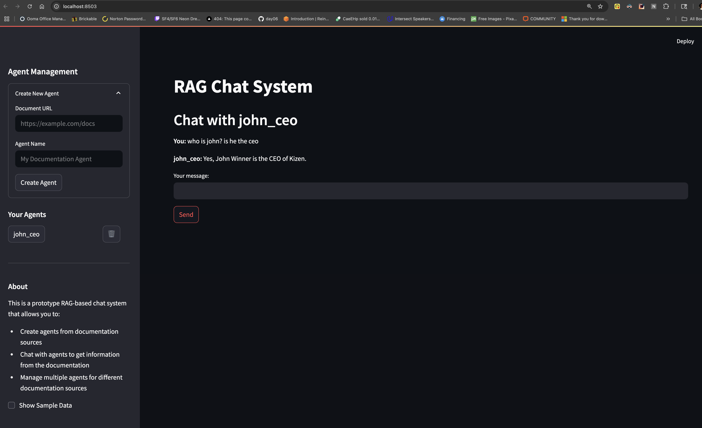

# 🤖 Job-Specific RAG Chat System

## 📚 Overview

**Job-Specific RAG Chat System** is a Retrieval-Augmented Generation (RAG) based AI chat platform that enables users to create intelligent agents trained on job listings from Greenhouse job boards. These agents can answer specific questions about job requirements, responsibilities, and qualifications using contextual memory and source retrieval.



---

## ✨ Features

* 🧠 **Job-Specific Agents** – Create chat agents for specific job listings from Greenhouse
* 🔍 **Automated Job Scraping** – Extract detailed job information directly from Greenhouse job boards
* 💬 **Contextual Chat** – Agents remember past interactions for coherent conversations
* 📂 **Agent Management** – Create, select, and delete agents as needed
* 🌐 **Interactive UI** – Streamlit-powered interface for intuitive usage

---

## 🛠️ Technical Components

* **Greenhouse Job Scraper**: Extracts job details from Greenhouse job board listings
* **Document Ingestion**: Processes job descriptions into vector embeddings
* **Vector Storage**: Stores embeddings for efficient similarity-based retrieval
* **Retriever**: Finds the most relevant job information for any query
* **LLM Integration**: Uses OpenAI to generate responses based on retrieved context
* **Web Interface**: Streamlit app for managing and interacting with agents

---

## 🚀 Getting Started

### ✅ Prerequisites

* Python `3.12`
* OpenAI API Key (set as an environment variable)

### 📦 Installation

```bash
# Clone the repository
git clone <repository-url>
cd privateRAG

# Install dependencies
pip install -r requirements.txt

# Set your OpenAI API key
export OPENAI_API_KEY=your-api-key
```

### ▶️ Running the App

```bash
streamlit run app.py
```

---

## 🧑‍💻 Usage Guide

1. 🆕 **Create** a new agent by entering a Greenhouse job URL and naming your agent
2. 🔄 **Select** an existing agent from the sidebar
3. 💬 **Chat** with the agent by asking specific questions about the job
4. 🗑️ **Delete** agents when they are no longer needed

---

## 🧪 Testing

The project includes test scripts to verify core functionality:

| Script           | Description                           |
| ---------------- | ------------------------------------- |
| `test_invoke.py` | Test direct chain invocation logic    |
 |

### Run Tests

```bash
python test_invoke.py
```

---

## 📁 Project Structure

```plaintext
rag-chat-system/
├── app.py                    # Main Streamlit application
├── chat_agent.py             # Agent creation and management
├── greenhouse_job_scraper.py # Scraper for Greenhouse job listings
├── ingest.py                 # Document ingestion and embedding
├── retriever.py              # Vector store retrieval logic
├── clean_text_column.py      # Utility for cleaning CSV text data
├── test_invoke.py            # Direct invocation test
└── requirements.txt          # Python dependencies
```

---

## 🔮 Future Improvements

* 📱 Mobile-responsive UI
* 🔄 Support for other job board platforms beyond Greenhouse
* 📊 Job comparison features
* 🔌 Integration with additional LLM providers
* 🔐 User authentication and personalized agents

---


## 👥 Contributors

* \[Mike Sylvester]

---

